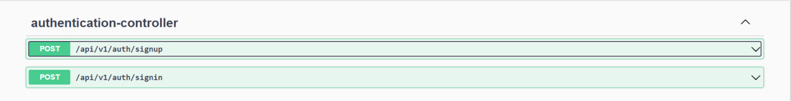
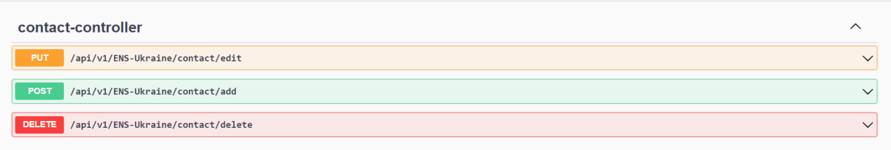

# ENS - Emergency Notification System

ENS (Emergency Notification System) is an advanced microservice-based emergency notification and messaging system designed to provide efficient communication during critical situations.

This project was initially developed using Maven and REST API if you seek for more traditionals technologies you can find it [here](https://github.com/StepanIP/emergency-notification-system).

This system is built upon a microservices architecture. This architecture empowers users to create accounts, devise notification templates, and dispatch notifications complete with attachments. As the system migrated to Gradle and a microservices-based structure, it significantly bolstered its scalability, enabling large-scale notification distribution and load balancing. The incorporation of a dependable delivery mechanism ensures that critical messages are reliably conveyed to recipients. The system optimizes real-time communication among services through the Kafka message broker, while an API gateway governs traffic and fortifies security measures.

## Base Features

- Accepts contact data in Excel format for easy import.
- Enables instant notifications to all contacts with a single click.
- Allows creating customizable notification templates.

## Advanced Features

- Provides a microservices architecture for enhanced scalability and load balancing.
- Ensures reliable message delivery through the Kafka message broker.
- Utilizes the Kafka message broker for real-time communication.
- Enhances security through Spring Security implementation.

## Architecture

## API Documentation

### security-service

The `security-service` manages authentication and authorization for the ENS system. It provides user account creation, authentication, and access control to protected resources.

Endpoints:

### producer-service

The `producer-service` is responsible for processing notifications and sending them to the message broker for further distribution. It handles the creation of notifications and their subsequent submission to the Kafka message broker.

Endpoints:

### consumer-service

The `consumer-service` subscribes to the Kafka message broker to receive notifications and process them for delivery. It ensures that notifications are reliably delivered to their intended recipients.

### common-service

The `common-service` contains shared classes, repositories, and services used across multiple services. It helps to avoid code duplication by centralizing common functionality.

### api-gateway

The `api-gateway` serves as an entry point to the microservices architecture, routing requests to the appropriate services. It also handles security, rate limiting, and other cross-cutting concerns.

### eureka-server

The `eureka-server` acts as a service registry and discovery server, allowing microservices to locate and communicate with each other easily.

## Getting Started

Follow these steps to set up and run the ENS system locally.

1. Clone this repository.
2. Configure the necessary environment variables.
3. Install the required dependencies.
4. Run the microservices using Docker Compose.

## License

This project is licensed under the [MIT License](LICENSE).
